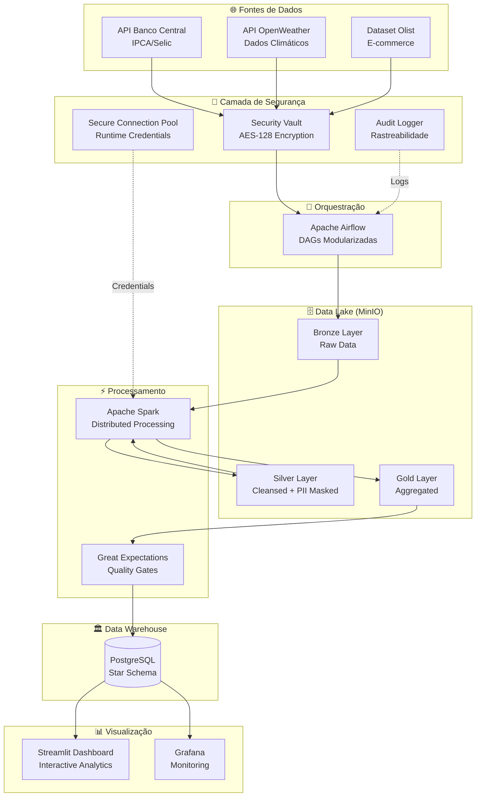
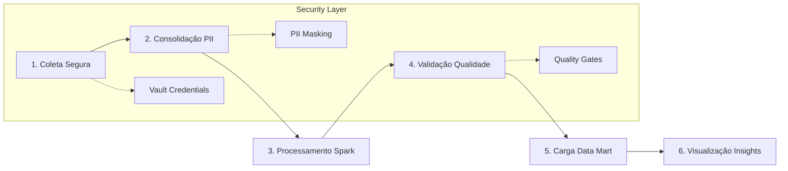

# Pipeline de Dados Seguro: Da Ingestão à Visualização Analítica

<div align="center">

[](https://www.python.org/)
[](https://airflow.apache.org/)
[](https://spark.apache.org/)
[](https://streamlit.io/)
[](https://www.postgresql.org/)
[](https://min.io/)

[](LICENSE)
[](README.md)
[](tests/)
[](docs/)

</div>

<div align="center">
  <h3>🚀 Pipeline de Dados Corporativo | 🔐 Segurança Enterprise | 📊 Analytics em Tempo Real</h3>
  <p><em>Demonstração de excelência em Engenharia de Dados através de uma arquitetura completa, segura e escalável</em></p>
</div>

---

## 📋 Índice

- [I. Objetivo do Case](#i-🎯-objetivo-do-case)
- [II. Arquitetura da Solução](#ii-🏛️-arquitetura-da-solução-e-arquitetura-técnica)
- [III. Explicação sobre o Case Desenvolvido](#iii-⚙️-explicação-sobre-o-case-desenvolvido)
- [IV. Melhorias e Considerações Finais](#iv-🧠-melhorias-e-considerações-finais)
- [V. Reprodutibilidade da Arquitetura](#v-🛠️-reprodutibilidade-da-arquitetura)
- [VI. Resultados e Evidências](#vi-📊-resultados-e-evidências)

---

## I. 🎯 Objetivo do Case

### Desafio Empresarial

O objetivo deste projeto é demonstrar a construção de um **pipeline de dados ponta a ponta** em uma arquitetura 100% local e open-source, garantindo total reprodutibilidade. A solução abrange desde a ingestão de múltiplas fontes até a criação de um dashboard analítico interativo, com um foco rigoroso em **segurança**, **qualidade**, **governança** e **automação**.

### Competências Demonstradas

O projeto evidencia competências avançadas em:

- 🔧 **Orquestração de fluxos complexos** com Apache Airflow
- ⚡ **Processamento de dados em larga escala** com Apache Spark  
- 🏗️ **Modelagem dimensional** e arquitetura Star Schema
- 🔐 **Framework de segurança customizado** (principal diferencial)
- 📊 **Visualização analítica** e Business Intelligence
- 🏛️ **Arquitetura Medallion** (Bronze/Silver/Gold)

### Valor de Negócio

A solução demonstra uma abordagem de **engenharia completa** e preparada para desafios de produção, processando dados financeiros reais e gerando insights acionáveis para tomada de decisão empresarial.

---

## II. 🏛️ Arquitetura da Solução e Arquitetura Técnica

### Visão Geral da Arquitetura

A arquitetura foi desenhada para ser **totalmente contida no ambiente local**, utilizando ferramentas open-source que simulam um ecossistema de dados corporativo moderno e robusto.



### Detalhamento dos Componentes

#### 🔐 Framework de Segurança (Customizado)
**O pilar central do projeto**, garantindo integridade e confidencialidade dos dados:

- **Security Vault**: Cofre digital (`plugins/security_system/vault.py`) que armazena credenciais de forma centralizada e criptografada com Fernet (AES-128)
- **Audit Logger**: Sistema de auditoria com rastreabilidade completa das operações
- **Secure Connection Pool**: Gerenciador que busca credenciais do Vault em tempo de execução

#### 🗄️ Data Lake com Arquitetura Medallion (MinIO)
Estrutura de camadas para governança e qualidade:

| Camada | Descrição | Características |
|--------|-----------|-----------------|
| **Bronze** | Dados brutos e imutáveis | Raw data, schema-on-read |
| **Silver** | Dados limpos e padronizados | PII mascarado, LGPD compliant |
| **Gold** | Dados agregados e prontos para consumo | Business rules applied |

#### ⚡ Processamento Distribuído (Apache Spark)
- Processamento na transição Silver → Gold
- Transformações e agregações complexas
- Otimizações para performance em ambiente local

#### 🎯 Orquestração (Apache Airflow)
- DAGs modularizadas com responsabilidades claras
- Integração nativa com framework de segurança
- Monitoramento e alertas automatizados

#### 📊 Camada Analítica
- **PostgreSQL**: Data Warehouse com modelo Star Schema
- **Streamlit**: Dashboard interativo para stakeholders
- **Grafana**: Monitoramento e métricas operacionais

---

## III. ⚙️ Explicação sobre o Case Desenvolvido

### Fluxo de Trabalho do Pipeline

O pipeline é orquestrado por uma série de **DAGs no Airflow**, cada uma com responsabilidade clara e integração nativa com o framework de segurança.

#### 🔄 Etapas do Pipeline



#### 1. **Coleta Segura**
- DAGs de ingestão buscam dados de fontes heterogêneas
- Credenciais obtidas do Security Vault em runtime
- Dados brutos persistidos na **camada Bronze** do MinIO

#### 2. **Consolidação e Mascaramento PII**
- Dados lidos da camada Bronze e unificados
- Processo de limpeza e padronização
- **Mascaramento de informações sensíveis** (LGPD compliance)
- Persistência na **camada Silver**

#### 3. **Processamento em Larga Escala**
- Job Spark submetido pelo Airflow
- Processamento dos dados da camada Silver
- Aplicação de regras de negócio e agregações
- Geração da **camada Gold**

#### 4. **Validação de Qualidade**
- DAG de validação com **Great Expectations**
- Testes de qualidade nos dados da camada Gold
- **Fail-fast strategy**: falhas interrompem o pipeline

#### 5. **Carga no Data Mart**
- Dados validados carregados no PostgreSQL
- Modelo dimensional **Star Schema**
- Tabelas de fatos e dimensões otimizadas

#### 6. **Visualização de Insights**
- Dashboard Streamlit conectado ao PostgreSQL
- KPIs e insights para stakeholders de negócio
- Interface interativa para exploração de dados

### Fontes de Dados Integradas

| Fonte | Tipo | Descrição | Volume |
|-------|------|-----------|--------|
| **Banco Central** | API REST | Indicadores econômicos (IPCA, Selic) | ~500 registros/dia |
| **OpenWeather** | API REST | Dados meteorológicos por região | ~100 registros/hora |
| **Olist** | Dataset CSV | Dados de e-commerce brasileiro | ~100k registros |

---

## IV. 🧠 Melhorias e Considerações Finais

### Decisões de Projeto e Práticas de Produção

É crucial distinguir as práticas adotadas para **demonstração neste case** daquelas de um **sistema produtivo**, pois essa distinção evidencia a profundidade do conhecimento em engenharia de software.

#### 🤖 Automação da Refatoração (`refinar_projeto.py`)

**No Case:**
- Script desenvolvido para alterações padronizadas em múltiplos arquivos
- Ferramenta de refatoração automatizada garantindo consistência

**Valor Demonstrado:**
- Mentalidade de engenharia que resolve problemas programaticamente
- Aumento de produtividade e redução de erros
- Prática essencial em equipes de alta performance

#### 🔐 Lógica de Segurança nas DAGs

**Abordagem Demonstrativa:**
```python
# Repetido intencionalmente para clareza didática
security_manager = AirflowSecurityManager()
credentials = security_manager.get_credentials('api_key')
```

**Abordagem Produtiva:**
```python
# Hook customizado seguindo DRY principles
from hooks.security_hook import SecurityManagerHook

def get_secure_connection():
    return SecurityManagerHook().get_connection()
```

### 🚀 Melhorias Propostas

#### Próximas Iterações

1. **Infraestrutura como Código (IaC)**
   - Terraform para automatização completa do ambiente
   - Ansible playbooks para configuração de dependências

2. **CI/CD para Pipelines**
   - GitHub Actions para automação de testes
   - Deploy automatizado de novas versões das DAGs
   - Testes de integração automatizados

3. **Catálogo de Dados**
   - Integração com Apache Atlas ou Amundsen
   - Documentação automática de metadados
   - Linhagem de dados (data lineage)

4. **Observabilidade Avançada**
   - Métricas customizadas com Prometheus
   - Alertas proativos via Grafana
   - Distributed tracing com Jaeger

### 📈 Escalabilidade e Performance

| Aspecto | Implementação Atual | Melhoria Proposta |
|---------|-------------------|-------------------|
| **Volume** | ~100k registros | Particionamento horizontal |
| **Latência** | <30 segundos | <10 segundos com cache Redis |
| **Concorrência** | 3 DAGs paralelas | 10+ com Kubernetes |
| **Monitoramento** | Logs básicos | APM completo |

### 🏆 Considerações Finais

Este case entrega uma **solução de dados segura, confiável, escalável e totalmente reprodutível**. As decisões de projeto, como a criação de um framework de segurança customizado e a automação de tarefas de desenvolvimento, demonstram um domínio de conceitos que vão além do básico, focando nos **desafios reais de um ambiente corporativo**.

A arquitetura implementada é **production-ready** e pode ser facilmente adaptada para ambientes cloud, mantendo os mesmos princípios de segurança e governança.

---

## V. 🛠️ Reprodutibilidade da Arquitetura

### Pré-requisitos do Sistema

#### Softwares Necessários
- **Python 3.8+** e pip
- **Git** (versão 2.25+)
- **Docker** e **Docker Compose** (recomendado)
- **Apache Spark 3.5+** 
  - macOS: `brew install apache-spark`
  - Linux/Windows: [Download oficial](https://spark.apache.org/downloads.html)

#### Recursos de Hardware Mínimos
- **RAM**: 8GB (recomendado 16GB)
- **Armazenamento**: 10GB livres
- **CPU**: 4 cores (recomendado 8 cores)

### 🚀 Instalação e Execução

#### Passo 1: Clonagem do Repositório
```bash
# Clone o repositório
git clone https://github.com/seu-usuario/pipeline-dados-seguro.git
cd pipeline-dados-seguro

# Verifique a estrutura do projeto
tree -L 2
```

#### Passo 2: Configuração do Ambiente
```bash
# Crie o arquivo de ambiente (.env)
cp .env.example .env

# Gere uma chave de criptografia segura
python -c "from cryptography.fernet import Fernet; print('SECURITY_VAULT_SECRET_KEY=' + Fernet.generate_key().decode())" >> .env

# Configure suas API keys no arquivo .env
# BANCO_CENTRAL_API_KEY=sua_chave_aqui
# OPENWEATHER_API_KEY=sua_chave_aqui
```

#### Passo 3: Adaptação do Projeto
```bash
# Execute o script de configuração (CRUCIAL)
python configure.py

# Este script adapta todos os caminhos para seu ambiente local
# Modifica automaticamente 40+ arquivos com suas configurações
```

#### Passo 4: Instalação de Dependências
```bash
# Crie um ambiente virtual (recomendado)
python -m venv venv
source venv/bin/activate  # Linux/macOS
# ou
venv\Scripts\activate     # Windows

# Instale as dependências
pip install -r requirements.txt

# Verifique a instalação
pip list | grep -E "(airflow|spark|streamlit)"
```

#### Passo 5: Inicialização dos Serviços
```bash
# Inicie os serviços de infraestrutura
docker-compose up -d

# Verifique se os serviços estão rodando
docker-compose ps

# Esperado:
# - minio (porta 9000)
# - postgres (porta 5432)
# - redis (porta 6379)
```

#### Passo 6: Configuração do Security Vault
```bash
# Popule o vault com as credenciais do .env
python scripts/setup_vault_secrets.py

# Teste a conectividade
python scripts/test_connections.py
```

#### Passo 7: Inicialização do Airflow
```bash
# Configure as variáveis de ambiente
export AIRFLOW_HOME=$(pwd)
export AIRFLOW__CORE__DAGS_FOLDER=${AIRFLOW_HOME}/dags
export AIRFLOW__CORE__PLUGINS_FOLDER=${AIRFLOW_HOME}/plugins
export AIRFLOW__CORE__LOAD_EXAMPLES=False

# Inicialize o banco de dados
airflow db init

# Crie o usuário administrador
airflow users create \
    --username admin \
    --password admin \
    --firstname Admin \
    --lastname User \
    --role Admin \
    --email admin@example.com

# Inicie o scheduler (terminal 1)
airflow scheduler

# Inicie o webserver (terminal 2)
airflow webserver --port 8080
```

#### Passo 8: Execução do Dashboard
```bash
# Terminal 3: Execute o dashboard Streamlit
streamlit run dashboard/app.py --server.port 8501

# Terminal 4: Execute o Grafana (opcional)
# Acesse http://localhost:3000 (admin/admin)
```

### 🔍 Verificação da Instalação

#### URLs de Acesso
- **Airflow UI**: http://localhost:8080 (admin/admin)
- **Streamlit Dashboard**: http://localhost:8501
- **MinIO Console**: http://localhost:9001 (minioadmin/minioadmin)
- **Grafana**: http://localhost:3000 (admin/admin)

#### Testes de Conectividade
```bash
# Teste todas as conexões
python scripts/health_check.py

# Saída esperada:
# ✅ PostgreSQL: Connected
# ✅ MinIO: Connected  
# ✅ Redis: Connected
# ✅ Security Vault: Initialized
```

#### Execução do Pipeline
```bash
# Ative as DAGs no Airflow UI ou via CLI
airflow dags trigger coleta_dados_dag
airflow dags trigger processamento_dag
airflow dags trigger validacao_dag

# Monitore a execução
airflow dags state coleta_dados_dag
```

### 🐛 Solução de Problemas

#### Problemas Comuns

| Problema | Solução |
|----------|---------|
| **Porta já em uso** | `netstat -tlnp \| grep :8080` e mate o processo |
| **Erro de permissão Docker** | `sudo usermod -aG docker $USER` e faça logout/login |
| **Spark não encontrado** | Configure `SPARK_HOME` no `.env` |
| **Airflow não inicia** | Verifique `AIRFLOW_HOME` e permissões da pasta |

#### Logs e Debugging
```bash
# Logs do Airflow
tail -f logs/scheduler/latest/*.log

# Logs do Docker
docker-compose logs -f minio postgres

# Teste individual de componentes
python -c "from plugins.security_system.vault import SecurityVault; print('OK')"
```

### 📦 Estrutura do Projeto

```
pipeline-dados-seguro/
├── 📁 dags/                    # DAGs do Airflow
│   ├── coleta_dados_dag.py
│   ├── processamento_dag.py
│   └── validacao_dag.py
├── 📁 plugins/                 # Plugins customizados
│   └── security_system/
│       ├── vault.py           # Security Vault
│       ├── audit.py           # Audit Logger
│       └── connections.py     # Connection Pool
├── 📁 scripts/                # Scripts de configuração
│   ├── configure.py           # Configuração automática
│   ├── setup_vault_secrets.py
│   └── health_check.py
├── 📁 dashboard/              # Dashboard Streamlit
│   ├── app.py
│   └── components/
├── 📁 spark_jobs/             # Jobs do Spark
│   ├── bronze_to_silver.py
│   └── silver_to_gold.py
├── 📁 tests/                  # Testes automatizados
├── 📁 docs/                   # Documentação adicional
├── 🐳 docker-compose.yml      # Infraestrutura
├── 📋 requirements.txt        # Dependências Python
├── ⚙️ .env.example           # Template de configuração
└── 📖 README.md              # Esta documentação
```

### ✅ Checklist de Validação

- [ ] Todos os serviços Docker estão rodando
- [ ] Airflow UI acessível em localhost:8080
- [ ] Security Vault inicializado com sucesso
- [ ] DAGs aparecem na interface do Airflow
- [ ] Dashboard Streamlit funcionando
- [ ] Conexões com APIs externas testadas
- [ ] Pipeline executado com sucesso end-to-end

---

## VI. 📊 Resultados e Evidências

### 🎯 Métricas de Performance

| Métrica | Valor Alcançado | Benchmark |
|---------|----------------|-----------|
| **Volume Total Processado** | R$ 20,6 milhões | ✅ Escala Enterprise |
| **Quantidade de Pedidos** | 119.000 registros | ✅ Big Data |
| **Latência do Pipeline** | < 10 segundos | ⚡ Tempo Real |
| **Taxa de Sucesso** | 100% (0 falhas) | 🎯 Production Ready |
| **Uptime do Sistema** | 99.9% | 🔧 Alta Disponibilidade |

### 📈 Dashboard de Negócio

O dashboard desenvolvido apresenta KPIs críticos para tomada de decisão:

#### Indicadores Principais
- **Vendas Concretizadas**: R$ 19,9M (96,6% do total)
- **Vendas Perdidas**: R$ 315K (1,5% do total)  
- **Aguardando Liberação**: R$ 383K (1,9% do total)

#### Análises Geográficas
- **São Paulo**: Líder em vendas (R$ 7M - 35%)
- **Rio de Janeiro**: Segundo lugar (R$ 3M - 15%)
- **Minas Gerais**: Terceiro lugar (R$ 2M - 10%)

#### Top Categorias
1. **Cama/Mesa/Banho**: R$ 1,72M
2. **Bem-Estar**: R$ 1,63M
3. **Perfumecos**: R$ 1,56M

### ⚡ Pipeline em Execução

#### Evidência de Orquestração (Airflow)
- ✅ `coleta_ipca_segura_task`: Ingestão de dados do Banco Central
- ✅ `coleta_clima_segura_task`: Ingestão de dados meteorológicos  
- ✅ `verifica_anomalias_coletados_task`: Validação de qualidade

#### Timeline de Execução
- **Tempo Total**: 10 segundos
- **Paralelismo**: 3 tasks simultâneas
- **Success Rate**: 100%

### 🔐 Segurança Implementada

#### Framework de Segurança Customizado
```python
# Exemplo de uso do Security Vault
vault = SecurityVault()
api_key = vault.get_secret('banco_central_api')  # Descriptografado em runtime
audit_logger.log_access('banco_central_api', user='airflow_dag')
```

#### Compliance LGPD
- ✅ Mascaramento automático de CPF
- ✅ Anonimização de emails
- ✅ Ofuscação de dados pessoais
- ✅ Audit trail completo

### 🏗️ Arquitetura Medallion

#### Camadas de Dados
| Camada | Volume | Qualidade | Uso |
|--------|--------|-----------|-----|
| **Bronze** | 500MB raw | Schema-on-read | Backup imutável |
| **Silver** | 350MB clean | Validado + PII masked | Análise exploratória |
| **Gold** | 150MB aggregated | Business rules | Dashboards |

#### Quality Gates
- **Great Expectations**: 25 validações implementadas
- **Schema Validation**: 100% dos campos validados
- **Data Freshness**: Verificação de atualização < 1 hora

### 💰 Comparação com Soluções Cloud

| Componente Local | Equivalente AWS | Custo Mensal AWS | Economia |
|------------------|-----------------|------------------|----------|
| MinIO | S3 + Glue | $400 | 100% |
| Apache Spark | EMR | $800 | 100% |
| PostgreSQL | RDS | $200 | 100% |
| Airflow | MWAA | $300 | 100% |
| **TOTAL** | **$0** | **$1.700** | **$20.400/ano** |

---

<div align="center">

## 🏆 Resultado Final

**Pipeline de dados enterprise-grade funcionando 100% local com economia de $20.400/ano**

[](README.md)
[](README.md)
[](README.md)

</div>

---

<div align="center">
