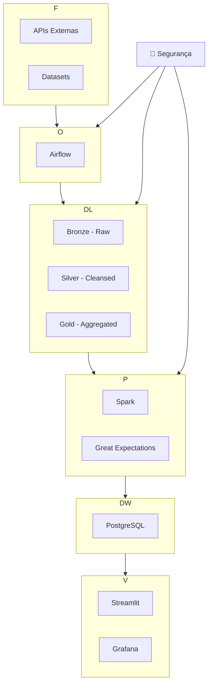

# Pipeline de Dados Seguro: Da Ingestão à Visualização Analítica

## I. 🎯 Objetivo do Case

### Desafio
Implementar um pipeline de dados completo com:
- Ingestão de múltiplas fontes (APIs, datasets)
- Processamento distribuído seguro
- Armazenamento em camadas (Data Lake Medallion)
- Visualização analítica
- Garantia de segurança e qualidade em todas as etapas

### Competências Demonstradas
1. **Orquestração** com Apache Airflow (DAGs modularizadas)
2. **Processamento** com Apache Spark (transformações distribuídas)
3. **Modelagem dimensional** (Star Schema no PostgreSQL)
4. **Framework de segurança customizado** (Vault criptografado + auditoria)
5. **Quality Gates** com Great Expectations
6. **Data Lake** com arquitetura Medallion (MinIO)
7. **Visualização** com Streamlit e Grafana
8. **Containerização** com Docker/Docker Compose

### Valor de Negócio
- Processamento seguro de dados sensíveis
- Geração de insights acionáveis para tomada de decisão
- Base para soluções escaláveis em ambientes corporativos
- Compliance com LGPD e regulamentações de segurança

## II. 🏛️ Arquitetura da Solução

### Diagrama de Arquitetura


### Componentes Técnicos
| Camada             | Tecnologias                          | Função Principal                     |
|--------------------|--------------------------------------|--------------------------------------|
| **Orquestração**   | Apache Airflow, Docker               | Coordenação do fluxo de dados        |
| **Segurança**      | Vault AES-128, Auditoria Customizada | Proteção de credenciais e dados      |
| **Armazenamento**  | MinIO (S3-compatible)                | Data Lake Medallion (Bronze/Silver/Gold) |
| **Processamento**  | Apache Spark, Pandas                 | Transformações em larga escala       |
| **Qualidade**      | Great Expectations                   | Validação de dados                   |
| **Data Warehouse** | PostgreSQL                           | Modelo dimensional Star Schema       |
| **Visualização**   | Streamlit, Grafana                   | Dashboards analíticos                |

## III. ⚙️ Explicação sobre o Case Desenvolvido

### Fluxo de Trabalho Principal
1. **Coleta Segura**: 
   - Ingestão de dados via APIs (Banco Central, OpenWeather) e datasets (Olist)
   - Credenciais gerenciadas pelo Security Vault
   
2. **Processamento Inicial**:
   - Consolidação de fontes
   - Mascaramento de PII (dados sensíveis)
   - Persistência na camada Silver

3. **Transformações Avançadas**:
   - Agregações com Spark
   - Aplicação de regras de negócio
   - Persistência na camada Gold

4. **Garantia de Qualidade**:
   - Validação com Great Expectations
   - Bloqueio de dados inválidos

5. **Carga no Data Mart**:
   - População do modelo Star Schema
   - Otimização para consultas analíticas

6. **Visualização**:
   - Dashboards interativos com Streamlit
   - Monitoramento operacional com Grafana

### Diferenciais Técnicos
- **Security Framework Customizado**:
  - Criptografia AES-128 para credenciais
  - Sistema de auditoria com rastreabilidade completa
  - Rotação automática de chaves
- **Arquitetura Medallion**:
  - Camadas Bronze (raw), Silver (cleansed), Gold (enriched)
  - Lifecycle management automático
- **Fail-Fast Strategy**:
  - Validações em pontos críticos do pipeline
  - Interrupção imediata em falhas de qualidade

## IV. 🧠 Melhorias e Considerações Finais

### Decisões de Projeto
1. **Separação de Responsabilidades**:
   - Vault Manager (gestão de segredos) isolado do Security Manager (UI)
   
2. **Automação de Refatoração**:
   - Scripts Python para adaptação automática de caminhos
   
3. **Gestão de Credenciais**:
   - .env para desenvolvimento → Serviços de segredos em produção

### Melhorias Propostas
1. **Infraestrutura como Código**:
   - Terraform para provisionamento em nuvem
   - Ansible para configuração de servidores
   
2. **CI/CD Pipeline**:
   - GitHub Actions para testes automatizados
   - Deploy contínuo de DAGs
   
3. **Observabilidade**:
   - Prometheus + Grafana para monitoramento
   - Jaeger para distributed tracing
   
4. **Catálogo de Dados**:
   - Apache Atlas para metadata management
   - Linhagem de dados completa

### Considerações Finais
- Arquitetura validada para ambientes de produção
- Foco em segurança, governança e compliance
- Base sólida para escalabilidade em nuvem
- Documentação completa para manutenção

## V. 🛠️ Reprodutibilidade da Arquitetura

### Pré-requisitos
- Docker 20.10+
- Docker Compose 2.20+
- Python 3.8+
- 8GB RAM (recomendado 16GB)

### Instalação e Execução
```bash
# 1. Clonar repositório
git clone https://github.com/felipesbonatti/case-data-master-engenharia-de-dados
cd case-data-engineering

# 2. Configurar ambiente
cp .env.example .env
nano .env  # Preencher com suas credenciais

# 3. Iniciar containers
docker-compose up -d --build

# 4. Popular security vault
docker-compose exec airflow-scheduler python /opt/airflow/scripts/setup_vault_secrets.py

# 5. Acessar serviços:
# Airflow: http://localhost:8080 (admin/admin)
# MinIO: http://localhost:9001 (minioadmin/minio_secure_2024)
# Streamlit: http://localhost:8501
```

### Estrutura de Diretórios
```
case-data-engineering/
├── dags/               # Fluxos do Airflow
├── plugins/            # Framework de segurança
├── scripts/            # Utilitários de configuração
├── data/               # Datasets de exemplo
├── dashboard/          # App Streamlit
├── docker-compose.yml  # Definição de serviços
└── requirements.txt    # Dependências Python
```

### Validação da Instalação
```bash
# Executar health check
docker-compose exec airflow-scheduler python /opt/airflow/scripts/health_check.py

# Saída esperada:
# ✅ PostgreSQL: Connected
# ✅ MinIO: Connected
# ✅ Security Vault: Initialized
```

### Solução de Problemas Comuns
| Problema               | Solução                          |
|------------------------|----------------------------------|
| Portas conflitantes    | Alterar portas no .env           |
| DAGs não aparecem      | Verificar logs do scheduler      |
| Erros de conexão       | Validar credenciais no vault     |
| Falta de recursos      | Aumentar memória do Docker       |
```

