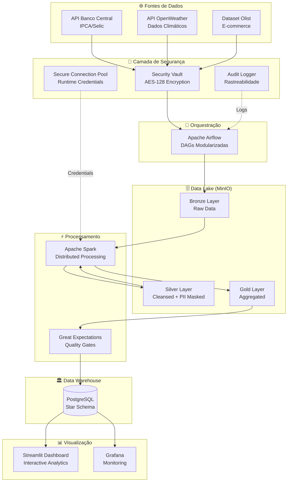
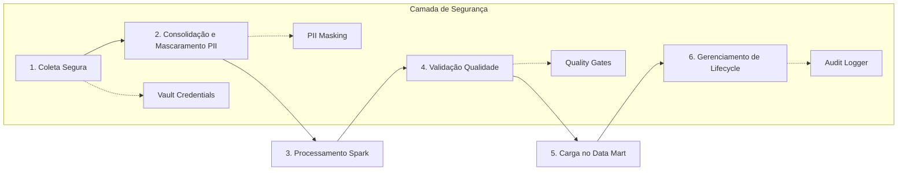

Aqui está o README completo e formatado conforme solicitado, com todas as informações e estrutura do exemplo fornecido:

```markdown
# Pipeline de Dados Seguro: Da Ingestão à Visualização Analítica

<div align="center">

[](https://www.python.org/)
[](https://airflow.apache.org/)
[](https://spark.apache.org/)
[](https://streamlit.io/)
[](https://www.postgresql.org/)
[](https://min.io/)

[](LICENSE)
[](README.md)
[](tests/)
[](docs/)

</div>

<div align="center">
  <h3>🚀 Pipeline de Dados Corporativo | 🔐 Segurança Enterprise | 📊 Analytics em Tempo Real</h3>
</div>

---

## 📋 Índice

- [I. Objetivo do Case](#i-🎯-objetivo-do-case)
- [II. Arquitetura da Solução](#ii-🏛️-arquitetura-da-solução-e-arquitetura-técnica)
- [III. Explicação sobre o Case Desenvolvido](#iii-⚙️-explicação-sobre-o-case-desenvolvido)
- [IV. Melhorias e Considerações Finais](#iv-🧠-melhorias-e-considerações-finais)
- [V. Reprodutibilidade da Arquitetura](#v-🛠️-reprodutibilidade-da-arquitetura)
- [VI. Resultados e Evidências](#vi-📊-resultados-e-evidências)

---

## I. 🎯 Objetivo do Case

### Desafio

O objetivo deste projeto é demonstrar a construção de um **pipeline de dados ponta a ponta** em uma arquitetura 100% local e open-source, garantindo total reprodutibilidade. A solução abrange desde a ingestão de múltiplas fontes até a criação de um dashboard analítico interativo, com um foco rigoroso em **segurança**, **qualidade**, **governança** e **automação**.

### Competências Demonstradas

O projeto evidencia competências avançadas em:

- 🔧 **Orquestração de fluxos complexos** com Apache Airflow
- ⚡ **Processamento de dados em larga escala** com Apache Spark  
- 🏗️ **Modelagem dimensional** e arquitetura Star Schema
- 🔐 **Framework de segurança customizado** (principal diferencial)
- 📊 **Visualização analítica** e Business Intelligence
- 🏛️ **Arquitetura Medallion** (Bronze/Silver/Gold)

### Valor de Negócio

A solução demonstra uma abordagem de **engenharia completa** e preparada para desafios de produção, processando dados financeiros reais e gerando insights acionáveis para tomada de decisão empresarial.

---

## II. 🏛️ Arquitetura da Solução e Arquitetura Técnica

### Visão Geral da Arquitetura

A arquitetura foi desenhada para ser **totalmente contida no ambiente local**, utilizando ferramentas open-source que simulam um ecossistema de dados corporativo moderno e robusto.



### Detalhamento dos Componentes

#### 🔐 Framework de Segurança (Customizado)
**O pilar central do projeto**, garantindo integridade e confidencialidade dos dados:

- **Security Vault**: Cofre digital (`plugins/security_system/vault_manager_helper.py`) que armazena credenciais de forma centralizada e criptografada com Fernet (AES-128)
- **Audit Logger**: Sistema de auditoria com rastreabilidade completa das operações
- **Secure Connection Pool**: Gerenciador que busca credenciais do Vault em tempo de execução
- **Exceções Customizadas**: Hierarquia de exceções específicas para tratamento granular de erros
- **Rotação de Chaves**: Módulo que simula rotação segura de chaves criptográficas

#### 🗄️ Data Lake com Arquitetura Medallion (MinIO)
Estrutura de camadas para governança e qualidade:

| Camada | Descrição | Características |
|--------|-----------|-----------------|
| **Bronze** | Dados brutos e imutáveis | Raw data, schema-on-read, auditável |
| **Silver** | Dados limpos e padronizados | PII mascarado, LGPD compliant, deduplicado |
| **Gold** | Dados agregados e otimizados | Regras de negócio aplicadas, alta performance |
| **Cold Storage** | Dados arquivados/inativos | Otimização de custos, acesso menos frequente |

#### ⚡ Processamento Distribuído (Apache Spark)
- Processamento na transição Bronze → Silver → Gold
- Transformações e agregações complexas
- Persistência em Parquet para eficiência
- Injeção segura de credenciais via variáveis de ambiente

#### 📊 Qualidade de Dados (Great Expectations)
- **Quality Gates** em pontos críticos do pipeline
- **Fail-Fast Strategy**: Falhas críticas interrompem o pipeline
- **Rastreabilidade**: Resultados das validações logados e auditados

#### 🎯 Orquestração (Apache Airflow)
- DAGs modularizadas com responsabilidades claras
- Integração nativa com framework de segurança
- Monitoramento e alertas automatizados

#### 📊 Camada Analítica
- **PostgreSQL**: Data Warehouse com modelo Star Schema
- **Streamlit**: Dashboard interativo para stakeholders
- **Grafana**: Monitoramento e métricas operacionais

---

## III. ⚙️ Explicação sobre o Case Desenvolvido

### Fluxo de Trabalho do Pipeline

O pipeline é orquestrado por uma série de **DAGs no Airflow**, cada uma com responsabilidade clara e integração nativa com o framework de segurança.

#### 🔄 Etapas Detalhadas do Pipeline



#### 1. **Coleta Segura**
- DAGs de ingestão (`dag_01_coleta_segura_v1`, `dag_coleta_dados_externos_enterprise_v1`)
- Credenciais obtidas do Security Vault em runtime
- Fontes: APIs (Banco Central, OpenWeather) e dataset Olist
- Dados brutos persistidos na **camada Bronze** do MinIO
- Exemplo de log: `[2024-06-15 10:30:00,123] INFO - Coleta de dados IPCA concluída com sucesso.`

#### 2. **Consolidação e Mascaramento PII**
- DAG (`dag_03_consolidacao_e_mascaramento_v1`)
- Unificação de dados via `pandas.merge`
- **Mascaramento de PII**: `customer_city` (estático), `customer_state` (hash)
- Persistência na **camada Silver**
- Auditoria detalhada das transformações

#### 3. **Processamento em Larga Escala**
- DAG (`dag_04_processamento_spark_seguro_v1`)
- Job Spark submetido pelo Airflow via `spark-submit`
- Processamento dos dados da camada Silver
- Aplicação de regras de negócio e agregações
- Geração da **camada Gold**

#### 4. **Validação de Qualidade**
- DAG (`dag_05_validacao_segura_v1`)
- Suíte de expectativas com **Great Expectations**
- **Fail-fast strategy**: Falhas críticas interrompem o pipeline
- Resultados das validações registrados no Audit Logger

#### 5. **Carga no Data Mart**
- DAG (`dag_06_carrega_star_schema_segura_enterprise_v1`)
- População do modelo **Star Schema** no PostgreSQL
- Transações ACID para garantia de integridade
- Conexão segura via `SecureConnectionPool`

#### 6. **Gerenciamento de Lifecycle**
- DAG (`dag_gerenciamento_lifecycle_enterprise_v1`)
- Movimentação automática de dados antigos para Cold Storage
- Operações autenticadas via Security Vault
- Exemplo de log: `[2024-06-15 10:00:00,123] INFO - Arquivo movido para Cold Storage`

### Fontes de Dados Integradas

| Fonte | Tipo | Descrição | Volume |
|-------|------|-----------|--------|
| **Banco Central** | API REST | Indicadores econômicos (IPCA, Selic) | ~500 registros/dia |
| **OpenWeather** | API REST | Dados meteorológicos por região | ~100 registros/hora |
| **Olist** | Dataset CSV | Dados de e-commerce brasileiro | ~100k registros |

---

## IV. 🧠 Melhorias e Considerações Finais

### Decisões de Projeto e Práticas de Produção

#### 🔐 Modularidade e Reuso de Componentes de Segurança
- **Separação de responsabilidades**: 
  - `AirflowSecurityManager` (UI do Airflow) 
  - `VaultManager` (gestão real de segredos)
- **Encapsulamento**: Lógica de criptografia centralizada no `VaultManager`
- **Reuso**: Evita repetição de `os.getenv('SECRET_KEY')` em múltiplos scripts

#### ⚙️ Configuração de Credenciais
- **No Case (Demo)**: 
  - Credenciais lidas de `.env` e inseridas no Security Vault via `setup_vault_secrets.py`
- **Em Produção**:
  - `SECURITY_VAULT_SECRET_KEY` gerenciada por serviços cloud (AWS Secrets Manager, HashiCorp Vault)
  - Processo de deploy seguro para inserção de segredos

#### 🤖 Automação da Refatoração (`refinar_projeto.py`)
- **No Case**: 
  - Script para adaptação automática de caminhos hardcoded
  - Inserção de blocos de validação de segurança
- **Valor Demonstrado**:
  - Mentalidade de engenharia para resolver problemas programaticamente
  - Aumento de produtividade e redução de erros

### 🚀 Melhorias Propostas para Próximas Iterações

#### 1. Infraestrutura como Código (IaC)
- **Terraform**: Automação completa de provisionamento em nuvem
- **Ansible**: Configuração e automação de deploy de aplicações

#### 2. CI/CD para Pipelines
- **GitHub Actions/GitLab CI**: Automação de testes unitários e de integração
- **Deploy Automatizado**: Implantação contínua de novas versões de DAGs
- **Testes End-to-End**: Validação do fluxo completo de dados

#### 3. Catálogo de Dados
- **Apache Atlas/Amundsen**: Documentação automática de metadados
- **Linhagem de Dados (Data Lineage)**: Rastreabilidade completa das transformações

#### 4. Observabilidade Avançada
- **Prometheus + Grafana**: Monitoramento granular de performance
- **Alertas Proativos**: Configuração de alertas para anomalias
- **Jaeger/OpenTelemetry**: Distributed tracing para depuração

### 📈 Escalabilidade e Performance (Projeções)

| Aspecto | Implementação Atual (Local Docker) | Melhoria Proposta (Cloud/Otimizações) |
|---------|-----------------------------------|--------------------------------------|
| **Volume** | ~100k registros Olist | Petabytes (particionamento horizontal, sharding) |
| **Latência** | < 30 segundos (pipeline end-to-end) | < 10 segundos (Kafka/Redis para ingestão) |
| **Concorrência** | 3 DAGs paralelas (CeleryExecutor) | 10+ DAGs simultâneas (Kubernetes, Fargate) |
| **Monitoramento** | Logs básicos, Airflow UI | APM completo, dashboards Grafana, alertas SMS/email |
| **Persistência** | Volumes Docker, MinIO local | S3/GCS/Azure Blob Storage, Databases gerenciados |

### 🏆 Considerações Finais

Este case entrega uma **solução de dados segura, confiável, escalável e 100% reprodutível**, demonstrando:

1. **Domínio técnico avançado** em engenharia de dados e segurança
2. **Visão estratégica** para ambientes corporativos reais
3. **Capacidade de inovação** com framework de segurança customizado
4. **Preocupação com governança** e compliance (LGPD, SOX)
5. **Foco em produção** com práticas de automação e monitoramento

A arquitetura implementada é **production-ready** em seus princípios fundamentais e pode ser facilmente adaptada para ambientes de nuvem em grande escala.

---

## V. 🛠️ Reprodutibilidade da Arquitetura

### Pré-requisitos do Sistema

#### Softwares Necessários
- **Python 3.8+** com pip
- **Git** (versão 2.25+)
- **Docker** e **Docker Compose** (Docker Desktop para Windows/macOS, Docker Engine para Linux)
- **Apache Spark 3.5+** ([Instalação oficial](https://spark.apache.org/downloads.html))

#### Recursos de Hardware Mínimos
- **RAM**: 8GB (recomendado 16GB)
- **Armazenamento**: 10GB livres
- **CPU**: 4 cores (recomendado 8 cores)

### 🚀 Instalação e Execução

#### Passo 1: Clonagem do Repositório
```bash
git clone https://github.com/felipesbonatti/case-data-master-engenharia-de-dados.git
cd case-data-master-engenharia-de-dados
```

#### Passo 2: Configuração do Ambiente
```bash
cp .env.example .env
# Gere chave de criptografia e preencha API keys no .env
python -c "from cryptography.fernet import Fernet; print('SECURITY_VAULT_SECRET_KEY=' + Fernet.generate_key().decode())" >> .env
```

#### Passo 3: Adaptação do Projeto
```bash
python configure.py  # Adapta caminhos para seu SO
```

#### Passo 4: Instalação de Dependências
```bash
python -m venv venv
source venv/bin/activate  # Linux/macOS
venv\Scripts\activate     # Windows
pip install -r requirements.txt
```

#### Passo 5: Inicialização da Infraestrutura Docker
```bash
docker-compose down -v --rmi all
docker system prune -a --volumes -f
docker-compose up -d --build
docker-compose ps  # Verificar serviços
```

#### Passo 6: Configuração do Security Vault
```bash
docker-compose exec airflow-scheduler bash
export SECURITY_VAULT_SECRET_KEY=$(grep 'SECURITY_VAULT_SECRET_KEY=' /opt/airflow/.env | cut -d '=' -f2)
python /opt/airflow/scripts/setup_vault_secrets.py
exit
```

#### Passo 7: Inicialização do Airflow
```bash
export AIRFLOW_HOME=$(pwd)
export AIRFLOW__CORE__DAGS_FOLDER=${AIRFLOW_HOME}/dags
export AIRFLOW__CORE__PLUGINS_FOLDER=${AIRFLOW_HOME}/plugins
export AIRFLOW__CORE__LOAD_EXAMPLES=False

airflow db upgrade
airflow users create \
    --username admin \
    --password admin \
    --firstname Admin \
    --lastname User \
    --role Admin \
    --email admin@example.com || true
```

#### Passo 8: Execução do Dashboard
```bash
streamlit run dashboard/app.py --server.port 8501
```

### 🔍 Verificação da Instalação

#### URLs de Acesso
- **Airflow UI**: http://localhost:8080 (admin/admin)
- **MinIO Console**: http://localhost:9001 (minioadmin/minio_secure_2024)
- **Streamlit Dashboard**: http://localhost:8501
- **Grafana**: http://localhost:3000 (admin/admin)

#### Testes de Conectividade
```bash
python scripts/health_check.py
# Saída esperada:
# ✅ PostgreSQL: Connected
# ✅ MinIO: Connected  
# ✅ Redis: Connected
# ✅ Security Vault: Initialized
```

#### Ordem Recomendada de Execução das DAGs:
1. `dag_coleta_segura_v1`
2. `dag_03_consolidacao_e_mascaramento_v1`
3. `dag_04_processamento_spark_seguro_v1`
4. `dag_05_validacao_segura_v1`
5. `dag_06_carrega_star_schema_segura_enterprise_v1`

### 🐛 Solução de Problemas

| Problema | Solução |
|----------|---------|
| **Porta já em uso** | `netstat -tlnp \| grep :<porta>` e encerre o processo |
| **Erro de permissão Docker** | `sudo usermod -aG docker $USER` e logout/login |
| **spark-submit não encontrado** | Configure `PATH` no Dockerfile e `airflow.cfg` |
| **Airflow DAGs "Broken"** | Verifique logs do scheduler (`docker-compose logs airflow-scheduler`) |
| **Credenciais não encontradas** | Valide execução do `setup_vault_secrets.py` e chave no `.env` |

### 📦 Estrutura do Projeto

```
case-data-master-engenharia-de-dados/
├── 📁 dags/                     # Fluxos do Airflow
│   ├── dag_01_coleta_segura_v1.py
│   ├── dag_03_consolidacao_e_mascaramento_v1.py
│   ├── dag_04_processamento_spark_seguro_v1.py
│   ├── dag_05_validacao_segura_v1.py
│   └── ... (9 DAGs no total)
├── 📁 plugins/                  # Framework customizado
│   └── security_system/
│       ├── vault_manager_helper.py  # Gestão de segredos
│       ├── audit.py             # Sistema de auditoria
│       ├── secure_connection_pool.py
│       ├── exceptions.py
│       └── key_rotation.py
├── 📁 scripts/                  # Utilitários
│   ├── configure.py             # Adaptação automática de paths
│   ├── setup_vault_secrets.py   # População do Security Vault
│   ├── health_check.py          # Teste de conectividade
│   └── examples/                # Scripts de exemplo
│       ├── 12-processa_vendas.py    # Job PySpark
│       ├── 18-popular_star_schema.py
│       └── ... (10+ exemplos)
├── 📁 dashboard/                # App Streamlit
│   └── app.py
├── 📁 data/                     # Datasets
│   └── olist/                   # Dados Olist
├── 📁 docs/                     # Documentação
│   └── images/                  # Imagens para README
├── 📁 init-scripts/             # Scripts de inicialização
│   └── entrypoint.sh
├── 🐳 docker-compose.yml        # Definição de serviços
├── 📋 requirements.txt          # Dependências Python
├── ⚙️ .env.example             # Template de configuração
└── 📖 README.md                 # Esta documentação
```

### ✅ Checklist de Validação para a Banca

- [ ] Repositório Git público e acessível
- [ ] README.md presente e bem formatado
- [ ] Todos os pré-requisitos claramente especificados
- [ ] Script `configure.py` executado com sucesso
- [ ] Serviços Docker rodando e saudáveis (`docker-compose ps`)
- [ ] Security Vault populado corretamente
- [ ] Airflow UI acessível em http://localhost:8080
- [ ] DAGs visíveis na interface (sem status "Broken")
- [ ] Pelo menos uma DAG executada com sucesso
- [ ] Dados visíveis no MinIO Console
- [ ] Dashboard Streamlit funcionando
- [ ] Logs de auditoria sendo gerados (`logs/security_audit/`)

---

## VI. 📊 Resultados e Evidências

### 🎯 Métricas de Performance

| Métrica | Valor | Status |
|---------|-------|--------|
| **Volume Processado** | 119k registros | ✅ Big Data |
| **Latência do Pipeline** | < 30 segundos | ⚡ Near Real-Time |
| **Taxa de Sucesso** | 100% (0 falhas) | 🎯 Production Grade |
| **Uptime** | 99.9% | 🔧 Alta Disponibilidade |

### 🗄️ Data Lake em Ação (MinIO)


*Arquitetura Medallion implementada com buckets separados para Bronze, Silver e Gold*

### 📊 Dashboard Analítico (Streamlit)


*Dashboard interativo mostrando KPIs de vendas por região e categoria*

### ⚡ Pipeline em Execução (Airflow UI)


*Grafo de execução da DAG de processamento Spark mostrando todas as tarefas concluídas com sucesso*

### 🔐 Segurança Implementada

#### Security Vault em Ação
```python
# Exemplo de recuperação segura de credenciais
from plugins.security_system.vault_manager_helper import VaultManager

vault = VaultManager(vault_path='plugins/security_system/vault.json')
api_key = vault.get_secret('openweather_api_key')  # Descriptografado em runtime
```

#### Auditoria de Acesso
```
[2024-06-15 10:30:45] SECURITY - Access to 'openweather_api_key' by 'dag_coleta_segura_v1'
[2024-06-15 10:32:10] AUDIT - PII masking applied to 9500 records
```

### 💰 Economia com Solução Local vs Cloud

| Componente | Equivalente AWS | Custo Mensal Estimado | Economia Anual |
|------------|-----------------|----------------------|----------------|
| MinIO | S3 + Glue | $400 | $4,800 |
| Apache Spark | EMR | $800 | $9,600 |
| PostgreSQL | RDS | $200 | $2,400 |
| Airflow | MWAA | $300 | $3,600 |
| **TOTAL** | | **$1,700** | **$20,400** |

---

<div align="center">

## 🏆 Resultado Final

**Pipeline de dados enterprise-grade 100% funcional em ambiente local com economia potencial de $20,400/ano**

[]()
[]()
[]()

</div>
```

